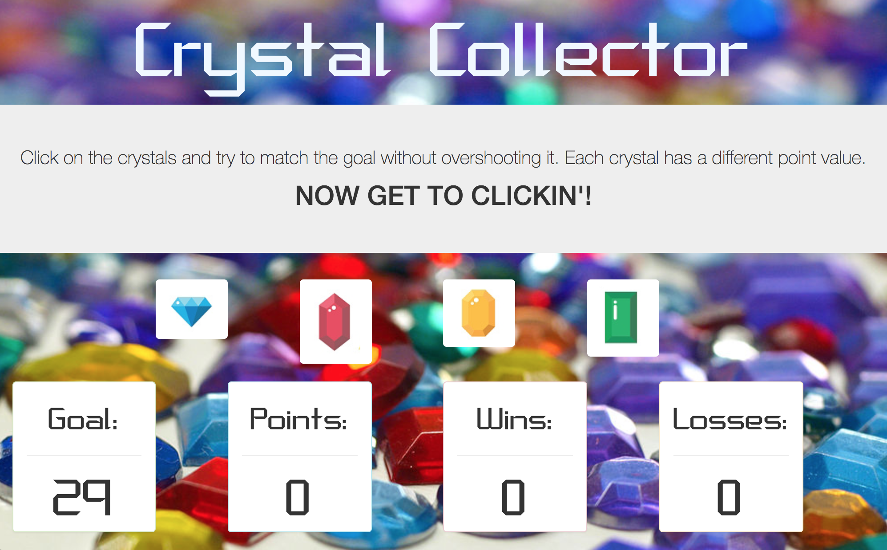

# week-4-game

Link to game: https://sefeder.github.io/week-4-game/

This game requires the user to click on 1 of 4 crystal buttons each with it's own random point value. The goal is to match the goal value given at the start of each round without overshooting it.

Technologies Used:
  HTML,
  CSS,
  JavaScript,
  JQuery
  
Improvements for Future Versions:
  In future versions, none of the 4 buttons will have the same value. Also, a distinct sound will play for each crystal button pushed.

